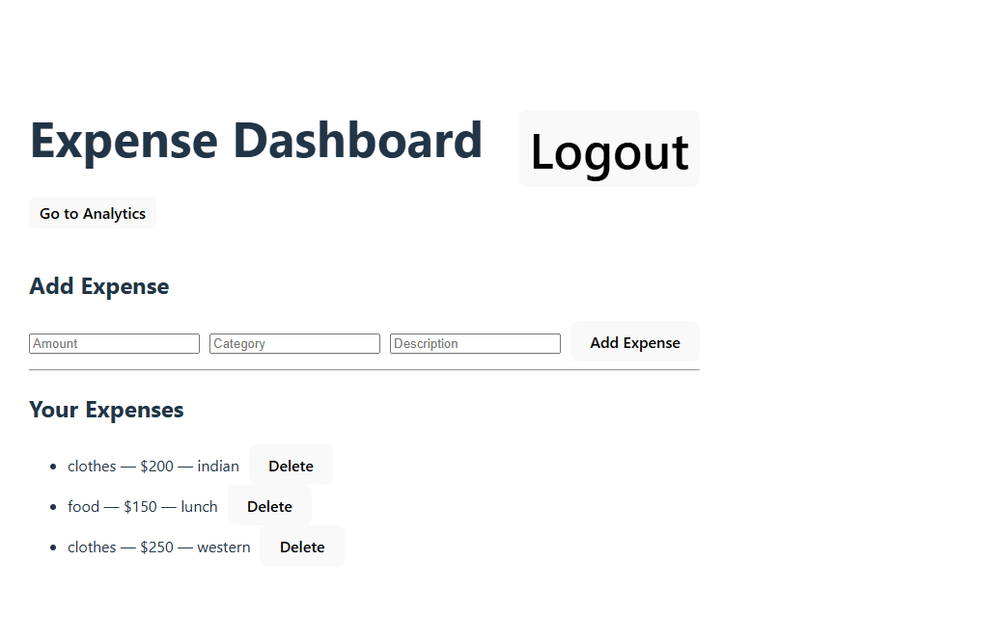
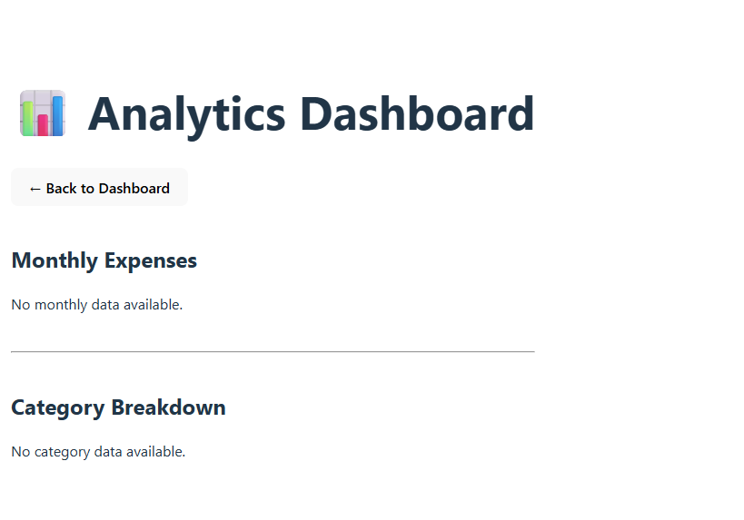

# SaaS Expense Tracker with Analytics

A full-stack expense tracking application where users can manage expenses and view spending analytics through charts.

## Features

- User authentication with JWT
- Add and delete expenses
- Dashboard to manage expenses
- Monthly analytics chart
- Category breakdown chart
- Secure API routes

## Tech Stack

Frontend
- React
- Vite
- Axios
- Recharts

Backend
- Node.js
- Express
- MongoDB
- Mongoose
- JWT Authentication

## Screenshots

### Dashboard

### Analytics

## Installation

Backend

npm install
npm run dev

Frontend

npm install
npm run dev

## Future Improvements

- Edit expenses
- Date filters
- Export to Excel
- Deployment with cloud hosting
